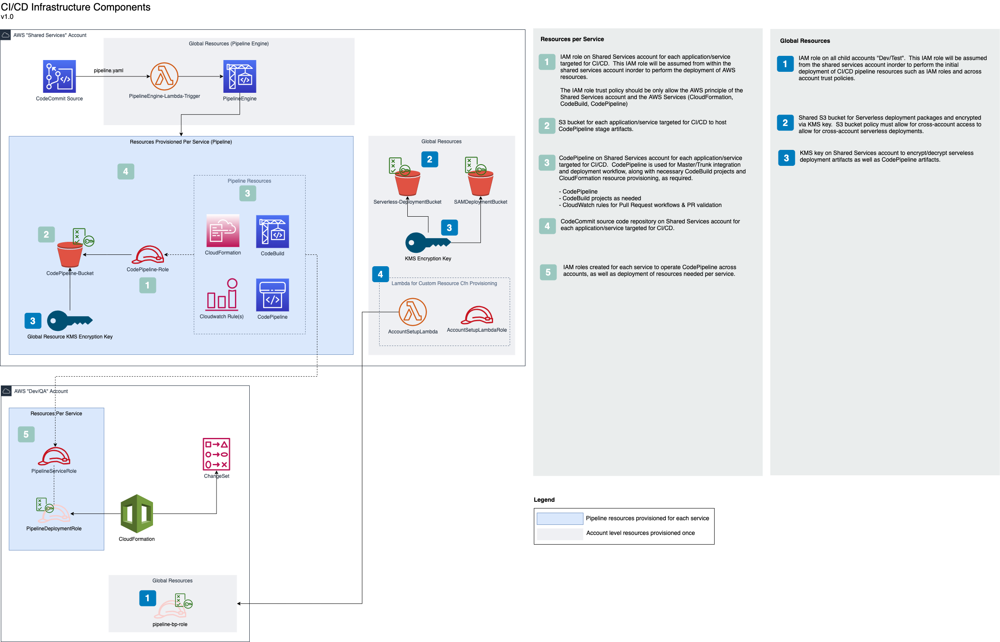
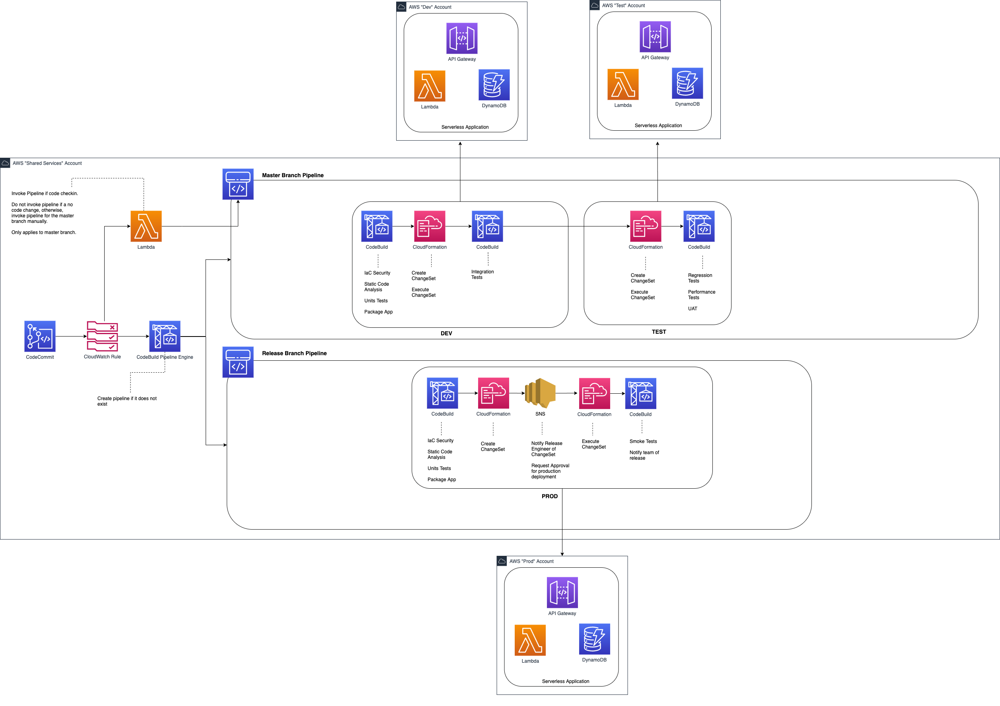
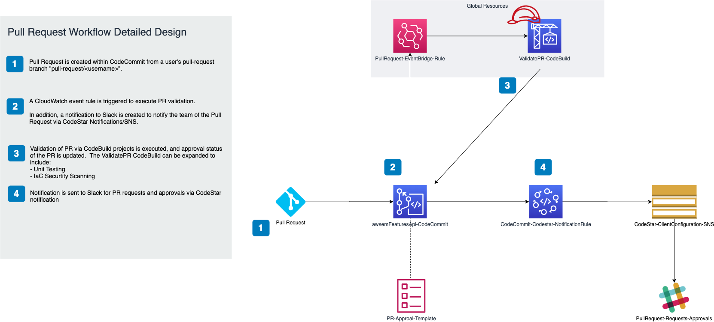
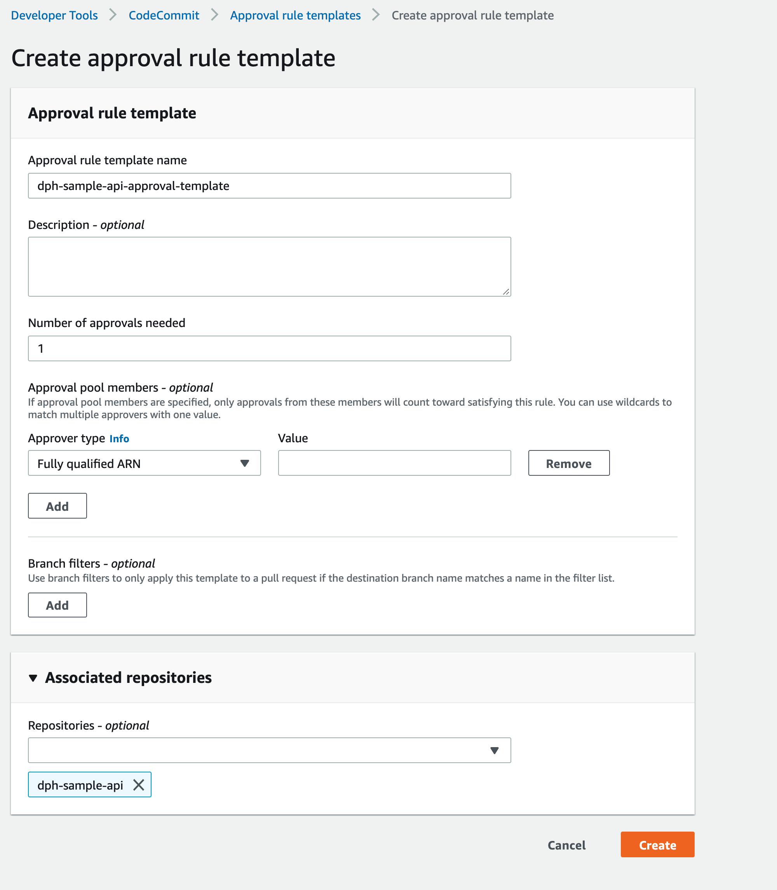

# Sample Infra Blueprint
## High Level Architecture

This is a template repository that can be used as a seed to create other Infrastructure repositories to provision AWS resources.  The pipeline.yaml file provides the implementation of core CI/CD capabilities.  The diagram below shows at a high-level in "blue" boxes the resrouces provisioned this solution via the pipeline.yaml file.

Note, this is dependent on the fact that the core components of the Pipeline-Engine are provisioned.  These components can be found at the location below:

https://github.com/aelmadho/aws-pipeline-engine

Pipeline related workflows are broken into "Master Workflow" and "Pull Request Workflow".  The "Master" workflow represents the deployment of a commit post approval and merge into master.

## Master Workflow
The diagram below shows a highlevel view of the master workflow/pipeline tasks.  The master workflow is triggered upon a merge to the "master" branch.

Deployment is performed via CloudFormation changesets and testing is facilicated by CodeBuild.  More details on testing specific tasks can be included within the CodeBuild spec file (buildspec-int-tests.yaml).

## Pull-Request Workflow

The diagram below shows the workflow of a Pull Request and its integration with AWS ChatBot and Slack Client integration.  The ValidatePR buildspec file "buildspec.validate-pr.yaml" can be expanded to include tasks to validate PR.

The approval of Pull Requests is performed via CodeBuild IAM role, by invoking CLI command to approve CodeCommit approval rule.

## How to use this
Clone this repository into your own code repository and modify application files as needed.  Upon any commits/updates to `pipeline.yaml`, the pipeline will be created/updated automatically by the Pipeline Engine.  The Pipeline Engine, implemented via CloudWatch, CodeBuild and CloudFormation detects `pipeline.yaml` and creates pipeline.

**NOTE**

To allow for automated Pull-Request approvals by the pipeline, there is manual step that must be followed due to lack of support in CloudFormation.  Navigate to "Developer Tools -> CodeCommit -> Approval rule templates" and create an Approval Template for your repository according to the screenshot below and associate it with your repository.  Select "Full qualified ARN" for approver-type and enter this value `arn:aws:sts::<AWS::AccountId>:assumed-role/<AppName>-PipelineServiceRole-*/*`

Remmber to replace `<AWS::AccountId>`, and `<AppName>` with the values that correspond to the application.  `<AppName>` is the name of your CodeCommit repository and must start with "dph-".

## Multi-Branch support
Currently, the pipeline engine supports the provisioning of resources in pipeline.yaml for only the "master" branch automatically.  
